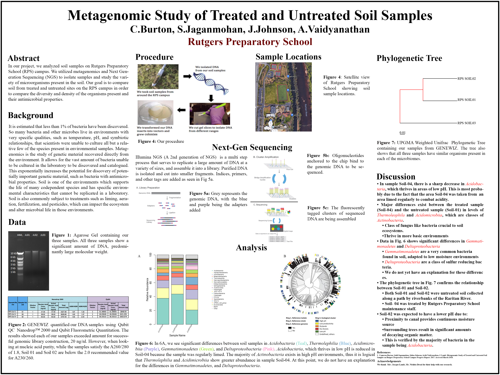
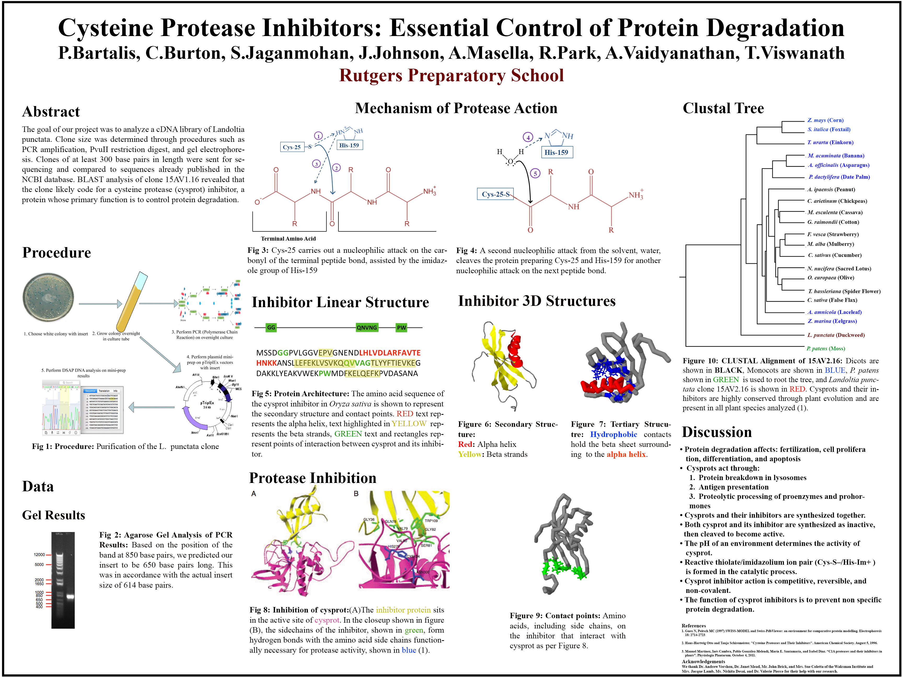

My early biology research covered environmental sampling, microbial identification, and molecular biology.

## Metagenomics

At Rutgers Preparatory School, I worked with metagenomics: genetic material recovered directly from environmental samples. DNA extracted from soil samples was cloned into bacterial artificial chromosome vectors and screened for antimicrobial activity. The work used next-generation sequencing of a region of microbial 16S ribosomal RNA genes to identify and quantify bacteria in campus soil samples.

## Waksman Institute research

With Rutgers University's Waksman Institute, I grew individual bacterial colonies containing engineered plasmids with inserts identifiable by selectable markers. The research also examined the function, process, and impact of proteins in *Landoltia punctata*, and resulted in multiple DNA-sequence submissions to NCBI.

