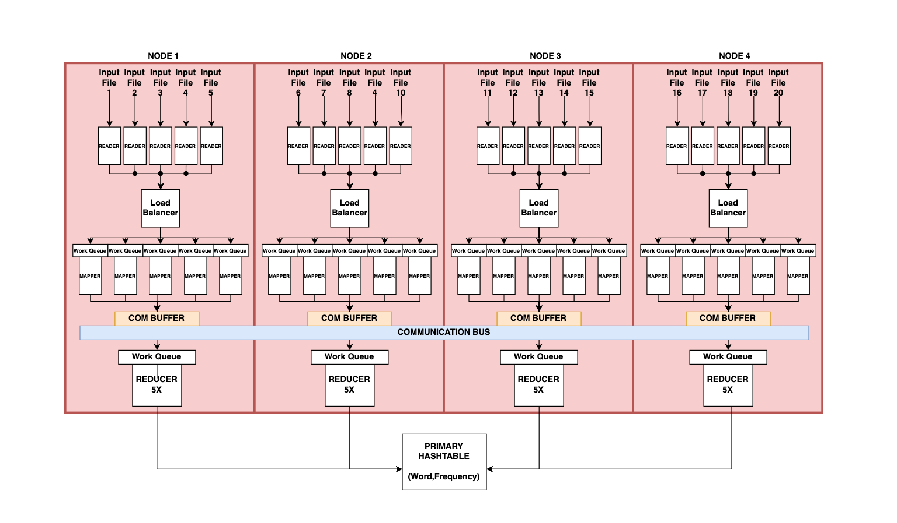

This project implemented MapReduce across several multi-core machines. Its job was to index words from large input text files while distributing the workload across concurrent processes.

*Legacy project diagram for the MapReduce implementation.*

## The goal

The implementation needed to process each word efficiently, merge independent concurrent processes, and keep time and space complexity in view.

## The approach

The project used C with OpenMP and MPI. OpenMP supported concurrent work within a machine, while MPI coordinated the distributed work across machines.
