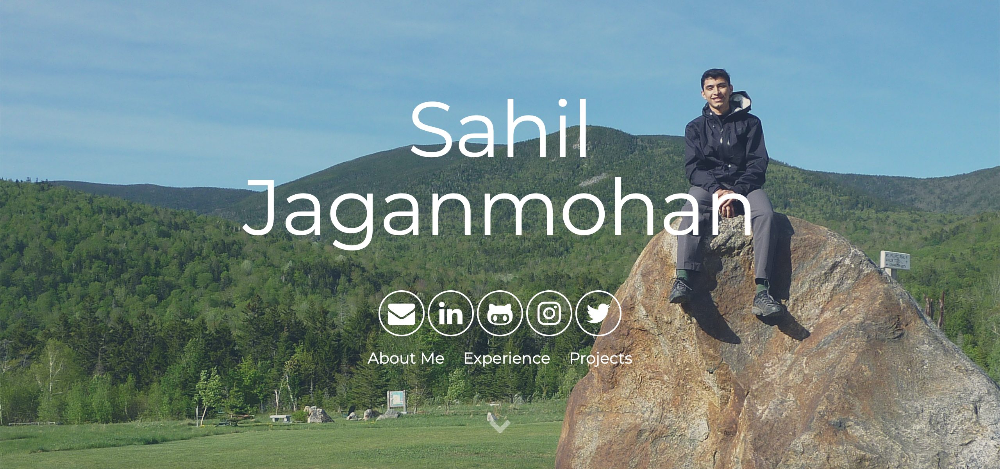
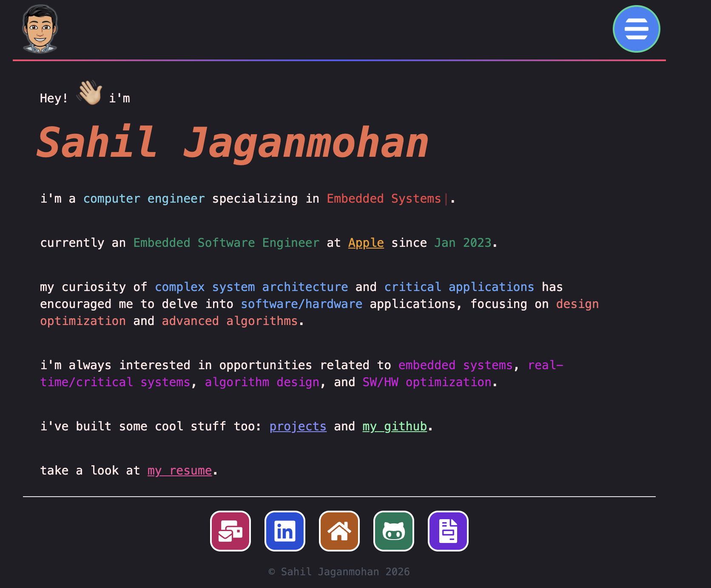

My first portfolio site was a Jekyll static site built in 2018 to share my skills and experience. The next version was a chance to learn React and rebuild the site from scratch.

## The progression

Portfolio 2.0 used React and Gatsby to make a full-stack site with an emphasis on speed, security, and low latency. GraphQL organized and queried the data displayed across the site.

## What I carried forward

The subject stayed the same: make my work and background easy to explore. Moving from a static-site generator to a React-based rebuild gave me a more direct way to learn the tools behind the site itself.
