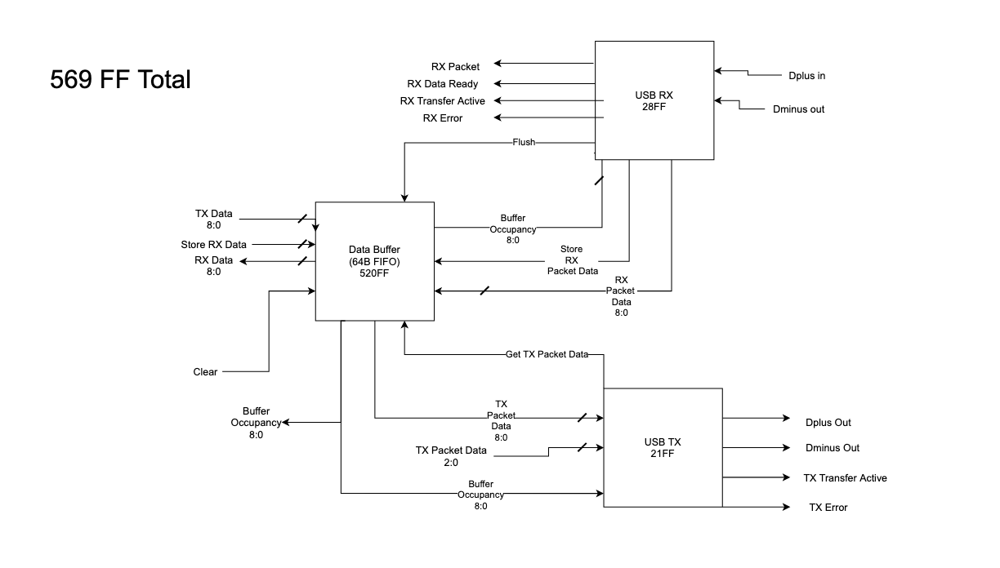
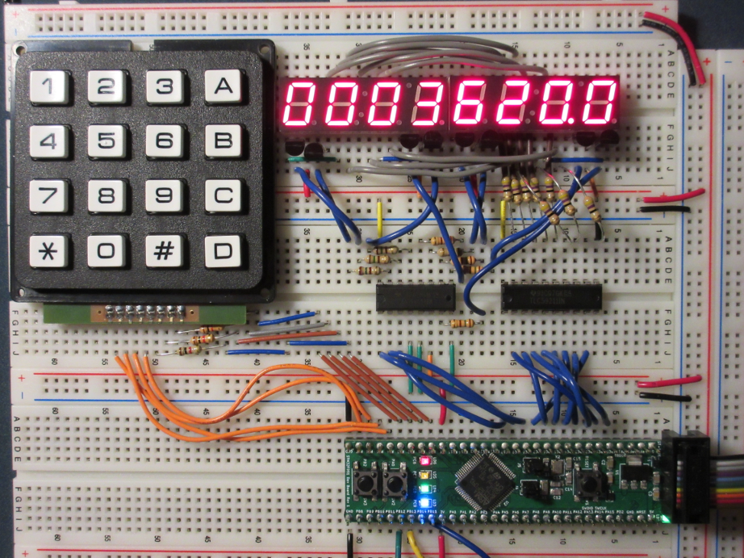
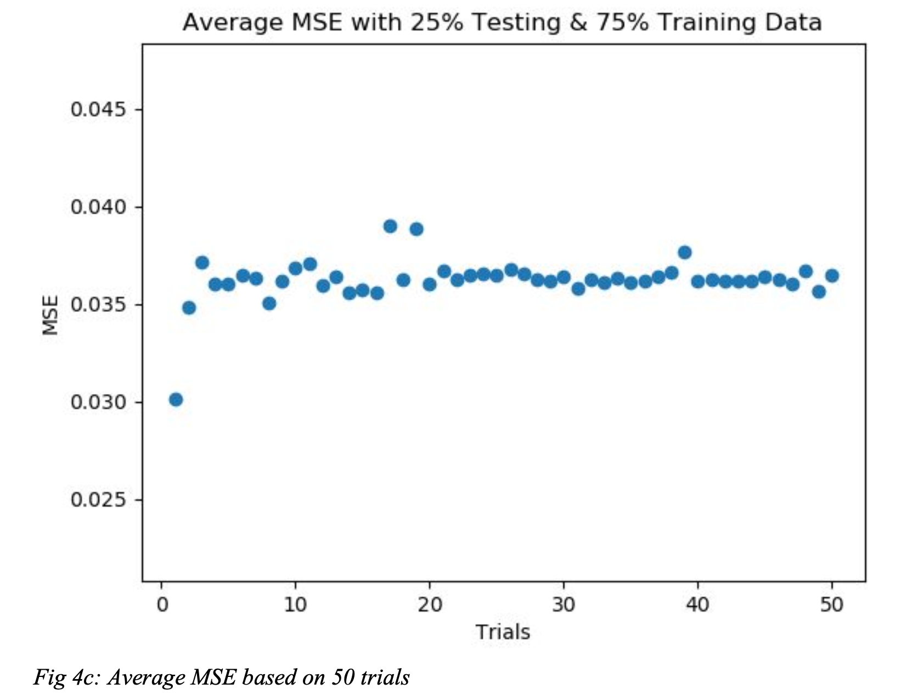

These are all the key projects that I worked on during my time at Purdue. Highlighting my experience and interest in hardware design, embedded firmware, and data analysis.

## USB full-speed bulk-transfer module

I designed, implemented, and verified a SystemVerilog SoC peripheral for USB full-speed bulk-transfer endpoint support on an AHB-Lite-based SoC. The module included a USB 1.0 transceiver, receiver, and data buffer.

## 2048 on an STM32

I built 2048 for an STM32 microcontroller using the ARM v6-M architecture. The game included keypad controls, scorekeeping, and LEDs for lives. Its board renderer reloaded only moved objects to minimize CPU use.

## MOOCs performance analysis

Working with the MOOCs data set, the goal was to predict whether a user would be correct on their first attempt at a question. 

A Gaussian-mixture clustering model (GMM) was developed and utilized to predict average and individual quiz performance.

[MOOCs performance analysis report (PDF)](moocs-performance-analysis.pdf)
